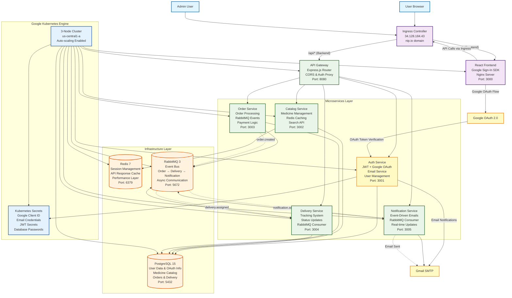
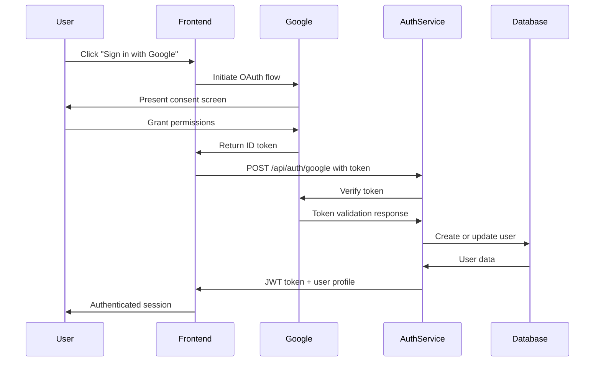
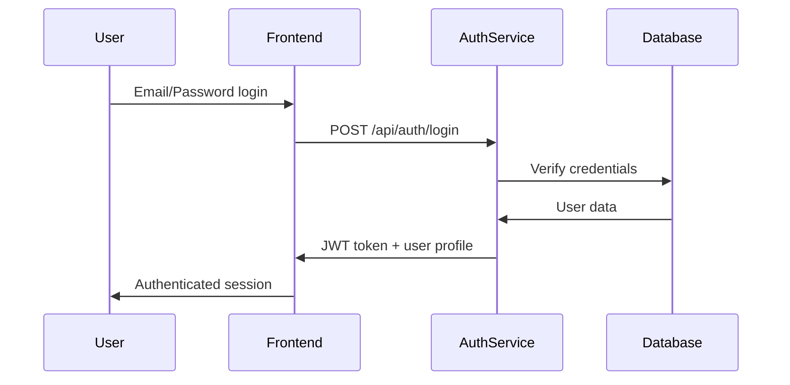
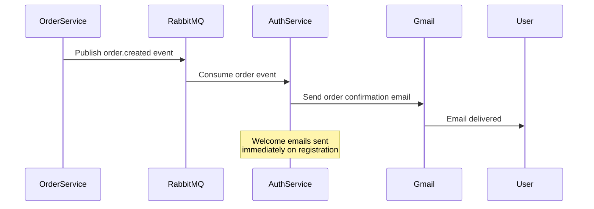

# Online Medicine Delivery - System Architecture

## Architecture Overview

This document describes the architecture of the Online Medicine Delivery platform deployed on Google Cloud Platform using Kubernetes, featuring Google OAuth integration, email notifications, and unified domain access through ingress controller.

## Current Production Configuration

**Production URL**: `http://34.128.184.43.nip.io`  
**API Base**: `http://34.128.184.43.nip.io/api`  
**Authentication**: Local and Google OAuth 2.0  
**Notifications**: Email via Gmail SMTP

## Architecture Diagram



## Component Details

### Ingress Layer

- **Single Domain Access**: `34.128.184.43.nip.io` for both frontend and API
- **Google Cloud Load Balancer**: Automatic SSL termination and global distribution
- **Path-based Routing**:
  - `/*` routes to React frontend
  - `/api/*` routes to API Gateway
- **nip.io DNS**: Wildcard DNS service for domain-based OAuth compliance

### Frontend Layer

- **React Application**: Modern SPA with Vite build system and Google Sign-In integration
- **Google OAuth SDK**: Client-side authentication with Google Identity Services
- **Dynamic API Detection**: Automatically routes API calls through ingress
- **Nginx Server**: Serves static files with optimized caching
- **Environment Configuration**:
  - `VITE_API_URL=http://34.128.184.43.nip.io/api`
  - `VITE_GOOGLE_CLIENT_ID=1050334836326-2jg080g9dm516nqpql4vh8niocg17itv`

### API Gateway Enhanced

- **Express.js Router**: Enhanced with dual routing for `/api` prefix support
- **Authentication Proxy**: Handles both JWT and Google OAuth verification
- **CORS Configuration**: Configured for nip.io domain access
- **Route Duplication**: Supports both direct and ingress-based API calls
- **Health Monitoring**: Comprehensive health checks for all services

### Enhanced Microservices

#### Auth Service (Enhanced)

- **Dual Authentication**: Local email/password and Google OAuth 2.0
- **Google Token Verification**: Server-side validation of Google ID tokens
- **Email Services**: Welcome emails, order confirmations, custom notifications
- **User Profile Management**: Stores Google profile data (name, picture)
- **JWT Generation**: Consistent token format for both auth methods
- **Database Schema**: Extended with Google OAuth fields

#### Catalog Service

- **Medicine Management**: Full CRUD with admin capabilities
- **Redis Caching**: High-performance medicine lookups
- **Search API**: Advanced filtering and search capabilities
- **Stock Management**: Real-time inventory tracking

#### Order Service

- **Order Processing**: Complete order lifecycle management
- **RabbitMQ Integration**: Publishes order events for downstream processing
- **Payment Processing**: Integrated payment logic
- **Order History**: Complete audit trail

#### Delivery Service

- **Tracking System**: Real-time delivery status updates
- **Event-Driven**: Consumes order events from RabbitMQ
- **Status Management**: Complete delivery lifecycle
- **Geographic Tracking**: Location-based delivery optimization

#### Notification Service (New)

- **Event-Driven Architecture**: Consumes events from RabbitMQ
- **Email Templates**: HTML email templates with branding
- **Multiple Triggers**: Welcome, order confirmation, delivery updates
- **Gmail Integration**: SMTP-based email delivery

### Enhanced Data Layer

#### PostgreSQL (Extended Schema)

- **User Management**: Extended with OAuth fields (google_id, auth_provider, profile_picture)
- **Medicine Catalog**: Complete inventory with categories and pricing
- **Order Management**: Full order lifecycle with items and payments
- **Delivery Tracking**: Status updates and geographic data
- **Audit Logging**: Complete system audit trail

#### Redis (Optimized)

- **API Response Caching**: Improves medicine catalog performance
- **Session Management**: User session persistence
- **Search Result Caching**: Optimized search performance
- **Rate Limiting**: API rate limiting implementation

#### RabbitMQ (Event-Driven)

- **Exchange Configuration**: Topic-based event routing
- **Event Types**: order.created, delivery.updated, notification.send
- **Queue Bindings**: Service-specific queue consumption
- **Dead Letter Queues**: Error handling and retry logic

### Infrastructure (Production-Ready)

#### Google Kubernetes Engine

- **3-Node Cluster**: Auto-scaling with resource optimization
- **Namespace Isolation**: medicine-delivery namespace
- **Resource Management**: CPU and memory limits for all pods
- **Health Checks**: Liveness and readiness probes
- **Horizontal Pod Autoscaling**: Automatic scaling based on metrics

#### Security Configuration

- **Kubernetes Secrets**: Secure storage of sensitive data
  - Google OAuth client ID and secret
  - Gmail SMTP credentials
  - JWT signing secrets
  - Database passwords
- **RBAC**: Role-based access control
- **Network Policies**: Pod-to-pod communication security
- **Container Security**: Non-root containers with security contexts

## Authentication Architecture

### Google OAuth 2.0 Flow



### Local Authentication Flow



## Email Notification Architecture

### Event-Driven Email Flow



## Deployment Architecture

### Current Kubernetes Configuration

```yaml
# Namespace: medicine-delivery
# Services: ClusterIP for internal, Ingress for external
# Resources: Optimized for production workload
# Scaling: HPA enabled for critical services
```

### Service Mesh

```
Ingress (34.128.184.43.nip.io)
├── Frontend (React + Google OAuth)
└── Gateway (/api/*)
    ├── Auth Service (JWT + Google OAuth + Email)
    ├── Catalog Service (Redis cached)
    ├── Order Service (RabbitMQ events)
    ├── Delivery Service (RabbitMQ consumer)
    └── Notification Service (Email sender)
```

## Technology Stack (Updated)

### Frontend Technologies

- React 18 with Hooks and Context API
- Google Identity Services SDK
- Vite for optimized build and hot reloading
- Tailwind CSS for responsive design
- Nginx for production serving

### Backend Technologies

- Node.js 20 with Express.js framework
- Google Auth Library for OAuth verification
- Nodemailer for email services
- bcrypt for password security
- JSON Web Tokens for session management
- Helmet for security headers
- CORS for cross-origin support

### Infrastructure Technologies

- Google Kubernetes Engine (GKE) for orchestration
- Google Container Registry for image storage
- Google Cloud Load Balancer for ingress
- PostgreSQL 15 for primary database
- Redis 7 for caching and sessions
- RabbitMQ 3 for event-driven messaging
- Docker for containerization

## Security Features (Enhanced)

### Authentication Security

- Google OAuth 2.0 with server-side token verification
- JWT tokens with secure signing and expiration
- bcrypt password hashing for local accounts
- Role-based access control (ADMIN/CUSTOMER)

### Infrastructure Security

- Kubernetes RBAC for cluster access control
- Secrets management for sensitive data
- Network policies for pod communication
- Container security contexts (non-root)
- Resource quotas and limits

### Application Security

- Helmet.js for security headers
- CORS configuration for domain restrictions
- Input validation with Zod schemas
- SQL injection prevention with parameterized queries
- Rate limiting and request size limits

## Monitoring and Observability

### Health Monitoring

- Health check endpoints for all services
- Kubernetes liveness and readiness probes
- Service dependency health verification
- Database connection monitoring

### Logging Strategy

- Centralized logging through Kubernetes
- Service-specific log levels
- Error tracking and alerting
- Audit logging for sensitive operations

### Performance Monitoring

- Redis performance metrics
- Database query optimization
- API response time tracking
- Resource utilization monitoring
